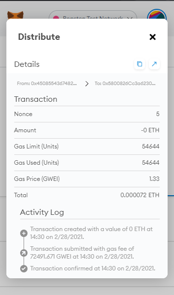

# Solidity
Unit 20 - Gregory Terrinoni

### Associate Profit Splitter

[**Solidity Code File**](AssociateProfitSplitter.sol)

[**Link to contract on ethereumTestnet**](https://teth.bitaps.com/0x23A036731379C29AF96e2d017A77B1F32920E398)

**Contract Address:** 0x23A036731379C29AF96e2d017A77B1F32920E398

**Contract Creation Details**

**Description**:  This contracts splits up a user defined input of Ether equally among 3 different contract addresses.  Any remaining balance will be transfered back into the wallet of the original sender.

**Using the Contract**

Make sure you have three different addresses set (different from the address sending the ether) and choose a value for ether and then deploy.

**MetaMask Window**

**Transaction on Etherscan**

[**Transaction on EtherScan**](https://teth.bitaps.com/0x8d2f31c1c3b1f6c5f3e437fc0a3bbc71c5a35538ca188c92ca0858e9d92ce821/0x450855436748256107d1F8e3F772c15cD8A3B2C9)

### Tiered Profit Splitter

[**Solidity Code File**](TieredProfitSplitter.sol)

[**Link to contract on ethereumTestnet**](https://teth.bitaps.com/0x44fc6a1e3e0ece93dd2fdf8bf71b884cd1535659)

**Contract Address:** 0x44FC6A1e3E0eCE93dd2FdF8Bf71b884cd1535659

**Contract Creation Details**

**Description**:  This contracts splits up a user defined input of Ether in a tiered amount as follows:

CEO - 60%
CTO - 25%
Bob (random employee) - 15%

Any remaining ether is then transfered to the CEO (because of course it does!).

**Using the Contract**

Make sure you have three different addresses set (different from the address sending the ether) and choose a value for ether and then deploy.

**MetaMask Window**

**Transaction on Etherscan**

[**Transaction on EtherScan**](https://teth.bitaps.com/0x4a6515af1941bdcb810acd5039020306916e888d683c987b95fbb7ad844701b3/0x450855436748256107d1F8e3F772c15cD8A3B2C9)

### Deferred Equity Plan

[**Solidity Code File**](DeferredEquityPlan.sol)

[**Link to contract on ethereumTestnet**](https://teth.bitaps.com/0x5800826Cc3a62307179F8dc920cA48019CBe480B)

**Contract Address:** 0x5800826Cc3a62307179F8dc920cA48019CBe480B

**Contract Creation Details**

**Description**:  This contract manages an employees deferred equity plan.  In this example, the employee is issued 1000 'shares' upon joining the company that vests over a 4 year period in equal 250 share amounts. 

It has built in checks to ensure that the shares get released evenly throughout time and that they aren't taking out more than the 1000 shares they were originally issued. 

*Reminder: Don't Send ETH to this contract!*

**Using the Contract**

**MetaMask Window**

**Transaction on Etherscan**

[**Transaction on EtherScan**](https://teth.bitaps.com/0x45c8ccfef135dcd949efde66d093f0dd162f486448e5a54d13221d8471cf655b/0x450855436748256107d1F8e3F772c15cD8A3B2C9)